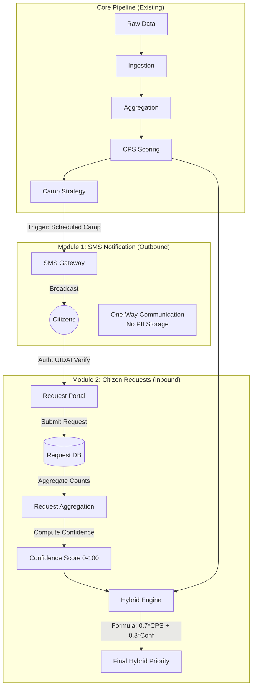

# Post-MVP Architecture: Aadhaar Netra Enhancements

This document outlines the architecture for two prospective modules designed to close the feedback loop with citizens: a **Localized SMS Notification System** (Outbound) and an **Authenticated Citizen Request System** (Inbound).

## High-Level Architecture

The system expands from a purely data-driven pipeline to a hybrid model that incorporates direct citizen demand and proactive communication.

---

## Module 1: Localized SMS Notification System
**Purpose**: Proactively inform residents of scheduled interventions.

### Design
1.  **Trigger**: The `generate_camp_strategy` step outputs a final list of scheduled camps (e.g., "District D001: Intensive Camp starting 2024-02-01").
2.  **Logic**:
    *   Identify target district.
    *   Retrieve masked mobile contact list for that district (handled by external telecom/UIDAI secure gateway, not stored in Netra).
    *   Construct Message.
3.  **Message Protocol**:
    *   **Format**: `"Aadhaar Netra Update: Biometric camps scheduled in [District Name] on [Start Date]. Visit: [Portal Link]"`
    *   **Privacy**: System sends *District ID* and *Message Content* to the gateway. The pipeline **never** accesses individual phone numbers.

---

## Module 2: Authenticated Citizen Request System
**Purpose**: Capture ground-truth demand signal to refine data-driven priorities.

### Design
1.  **Authentication (Spam Prevention)**:
    *   Users must log in using Aadhaar-linked OTP or UIDAI SSO.
    *   Prevents bot attacks and duplicate voting.
2.  **Request Submission**:
    *   User selects **District** and **Sub-district/Locality**.
    *   System records timestamp and anonymized User ID hash (for rate limiting).
3.  **Aggregation & Scoring**:
    *   Requests are aggregated daily by district.
    *   **Normalization**: `Requests_received_norm` (0-1 scale relative to population or max requests).
    *   **Confidence Score**: `Requests_received_norm * 100`.

### Data Schema (Request DB)
| Field | Type | Description |
| :--- | :--- | :--- |
| `request_id` | UUID | Unique identifier. |
| `district_id` | String | Target district (Foreign Key). |
| `locality_hash` | String | Hash of sub-region for granular clustering. |
| `user_hash` | String | Anonymized user ID (one request per 30 days). |
| `timestamp` | DateTime | For recency weighting. |
| `status` | Enum | PENDING, PROCESSED, FULFILLED. |

### Integration: Hybrid Decision Engine
This module introduces a **Refined Priority Score** that adjusts the purely data-driven CPS based on expressed demand.

**Formula**:
> **`Final_Priority = (CPS_Score * 0.70) + (Citizen_Confidence_Score * 0.30)`**

*   **CPS (70% Weight)**: Ensures we prioritize neglected areas even if people aren't digitally active enough to request.
*   **Citizen Confidence (30% Weight)**: Ensures that high-demand areas get a boost, validating the data signal.

---

## Governance & Security constraints

1.  **Privacy by Design**:
    *   **SMS**: No PII ingressed. The pipeline only outputs "Where" and "When".
    *   **Requests**: User identity is validated but not stored with the request. Only the signal ("Someone in D001 needs a camp") is retained.
2.  **Anti-Abuse**:
    *   Rate limiting: 1 request per user per month.
    *   Geofencing (Optional): Browser location check to ensure user is requesting for their current vicinity.
3.  **Auditability**:
    *   All "Hybrid Adjustments" (where Citizen Score changed the rank) are logged separately to ensure the bias introduced is transparent.
